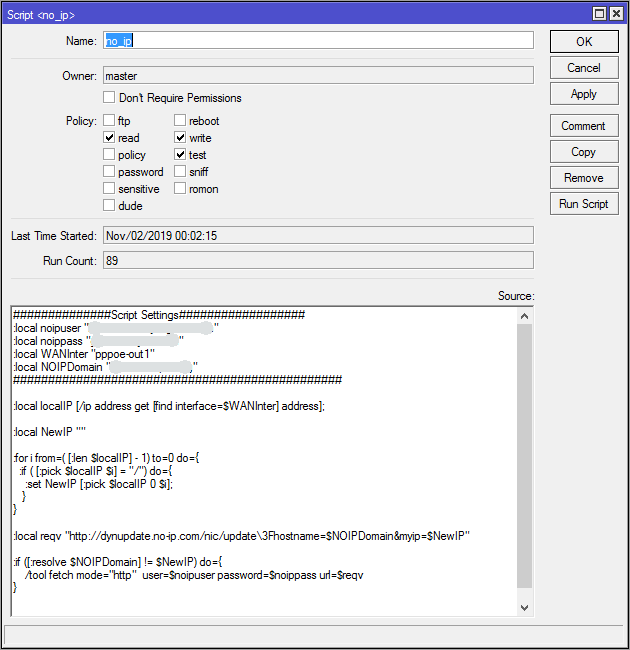
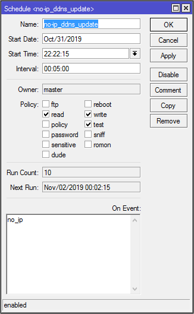

# MikroTik

Скрипт обновления IP на сервисе DDNS [No-IP](https://www.noip.com)

Запускаем `Winbox` (ну или Web GUI) и создаем новый скрипт, с именем «no-ip» (или любое другое) и правами `read, test, write`. Для этого заходим в `System -> Scripts` и нажимаем "+".  
  
После сохранения скрипта, необходимо создать для него новое задание в `Sheduler`. Заходим в `System —> Sheduler` и нажимаем на "+".  
Указываем имя задачи, интервал запуска (например 30 секунд), права `read, write, test`. В поле `On Event` укажите имя скрипта `no_ip`.  
  

Доплолнительная информация: [No-UP](http://www.noip.com/integrate/request) и [Скрипты для маршрутизатора](http://wiki.mikrotik.com/wiki/Manual:Scripting-examples)  